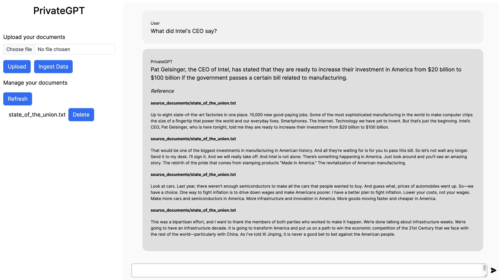

# PrivateGPT

Document QA pipeline using SentenceTransformers embeddings and local LLMs - private and secure.
Original pipeline from [imartinez](https://github.com/imartinez) and UI from [SamurAI](https://github.com/SamurAIGPT).

## Contents

* [Difference](#difference)
* [Requirements](#requirements)
* [How to run](#how-to-run)
* [Supported Documents](#supported-documents)
* [Check repos](#check-repos)

## Difference



* Retrieve a list of documents
* Delete documents
* View which part of the source documents the LLM referred to
* Library versions up to date with [original pipeline](https://github.com/imartinez/privateGPT) as of 3rd July 2023

## Requirements

* Python 3.8 or later
* NodeJS v18.12.1 or later
* Minimum 16GB of memory

## How to run

1. Go to client folder and run the below commands

   ```shell
   npm install   
   ```

   ```shell
   npm run dev
   ```

2. Go to server folder and run the below commands

   ```shell
   pip install -r requirements.txt
   ```

   ```shell
   python privateGPT.py
   ```

3. Open <http://localhost:3000>, click on download model to download the required model initially

4. Upload any document of your choice and click on Ingest data. Ingestion is fast

5. Now run any query on your data. Data querying is slow and thus wait for sometime

## Supported Documents

The supported extensions for documents are:

* .csv: CSV,
* .doc/.docx: Word Document,
* .enex: EverNote,
* .eml: Email,
* .epub: EPub,
* .html: HTML File,
* .md: Markdown,
* .odt: Open Document Text,
* .pdf: Portable Document Format (PDF),
* .ppt/.pptx : PowerPoint Document,
* .txt: Text file (UTF-8),

## Check repos

* [Original Pipeline](https://github.com/imartinez/privateGPT)
* [Original UI](https://github.com/SamurAIGPT/privateGPT)
